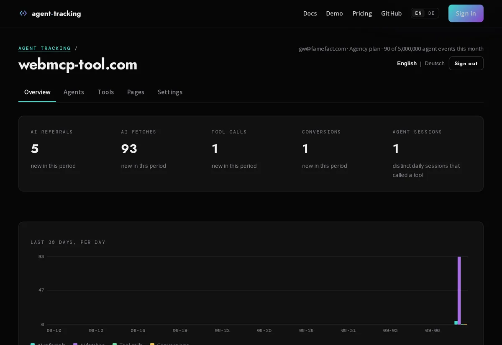

<p align="center">
  <a href="https://agenttracking.co"></a>
</p>

<h1 align="center">Agent Tracking</h1>

<p align="center"><b>See what AI agents do on your website.</b><br>
Which assistants send you visitors, which agents read your pages, which of your MCP and WebMCP tools they call, and whether they get to the goal.<br>
One line of script. No cookies, no personal data, no third-party scripts.</p>

<p align="center">
  <a href="https://github.com/shufflethis/agent-tracking/actions/workflows/ci.yml"></a>
  <a href="LICENSE"></a>
  
  
  
  
  <a href="https://agenttracking.co"></a>
</p>

<p align="center">
  <a href="https://agenttracking.co"><b>Cloud (free pilot)</b></a> ·
  <a href="https://agenttracking.co/docs">Docs</a> ·
  <a href="https://agenttracking.co/demo">Live demo</a> ·
  <a href="#self-hosting">Self-host</a> ·
  <a href="#stats-api-and-mcp-server">API and MCP</a> ·
  <a href="https://agenttracking.co/de">Deutsch</a>
</p>

---

## What agenttracking.co does

Your analytics counts people. It does not see the visitor ChatGPT sent you, the page ClaudeBot fetched at 3 a.m., or the `book_table` tool an assistant called inside your customer's browser. Agent Tracking does. It is analytics for the third kind of visitor: **the AI agent that reads, reasons and acts on your site**, whether it arrives as a crawler, as a live fetch on behalf of a user, or as an assistant driving your MCP and WebMCP tools.

You install one line:

```html
<script defer data-domain="example.com" src="https://agenttracking.co/agent.js"></script>
```

and get four views: **Overview**, **Agents**, **Tools**, **Pages**. Plus the same numbers as JSON and as an MCP tool, so your own agents can read them.

<p align="center"></p>

## What it sees

| Layer | What is measured | Where it comes from |
| --- | --- | --- |
| **AI referrals** | A person arrives from chatgpt.com, perplexity.ai, claude.ai, copilot.microsoft.com, gemini.google.com and a dozen more; which assistant, which landing page, how the share moves week over week | Referrer and `utm_source`, matched against a [published, versioned list](lib/tracking/ai-sources.json) |
| **AI fetches** | GPTBot, ClaudeBot, PerplexityBot, OAI-SearchBot, Google-Extended, Applebot-Extended, Bytespider, CCBot and the rest: who reads what, how often, with a trend | The snippet for agents that run JavaScript; your **server log** for the ones that do not, each line **verified against the vendor's published IP ranges**, and grouped into **fetch bursts** (one agent, many pages, a few seconds: what a query fan-out looks like from your side) |
| **Tool calls** | Every MCP and WebMCP tool on your site: calls, duration, success rate, error classes, argument key names, the tools nobody ever calls, and the moment a tool call reaches a goal you marked | The snippet wraps `navigator.modelContext` and `document.modelContext` and watches declarative `<form toolname>` elements. Nothing to change in your code |
| **Conversions** | Whether agents complete the thing the site is for: a booking, an order, a signup | `data-agent-goal` on any element, or a tool call marked as a goal |
| **Manifest** | Your `/.well-known/webmcp` manifest, hashed once per visit, so you notice when it changes | The snippet; Pro accounts get an email |

And, beside the numbers, the site's **Agent Readiness Score** from [webmcp-tool.com](https://webmcp-tool.com): how well the site itself can be used by agents, next to how much it actually is.

## Why it exists, and what makes it different

Every tool on the market measures one of two things: **people** (Google Analytics, Plausible, Matomo) or **crawlers** (Cloudflare AI Audit, bot managers, log analyzers). Neither can see an agent that has already got past the door and is using your site: calling a tool, filling a form, finishing a booking on someone's behalf. That is the layer where the money and the risk are, and it is the layer nobody was measuring. Agent Tracking was built for it.

| | Agent Tracking | Web analytics | CDN bot audit | Log analyzers | AI referral SaaS |
| --- | :---: | :---: | :---: | :---: | :---: |
| AI referrals attributed to the assistant | ✅ | partly | ❌ | ❌ | ✅ |
| Crawler fetches, verified against vendor IP ranges | ✅ | ❌ | ✅ | partly | ❌ |
| Fetch bursts (query fan-outs) | ✅ | ❌ | ❌ | ❌ | ❌ |
| **MCP and WebMCP tool calls, success, errors, duration** | ✅ | ❌ | ❌ | ❌ | ❌ |
| Agent conversions (goals reached by agents) | ✅ | ❌ | ❌ | ❌ | ❌ |
| Manifest change alerts | ✅ | ❌ | ❌ | ❌ | ❌ |
| Readiness score beside the usage | ✅ | ❌ | ❌ | ❌ | ❌ |
| Works without a CDN or proxy in front of the site | ✅ | ✅ | ❌ | ✅ | ✅ |
| No cookies, no IP stored, no consent banner needed | ✅ | some | n/a | ❌ | rarely |
| Data stays in the EU | ✅ (server in Germany) | depends | ❌ | ✅ | ❌ |
| Numbers available as JSON and as an MCP tool | ✅ | API only | ❌ | ❌ | API only |
| Open source, self-hostable, one file to back up | ✅ | some | ❌ | ✅ | ❌ |

The comparison names categories, not vendors, because products change. Check any one of them against the rows above; the middle five rows are the ones you will not find elsewhere.

### Built for European companies and professionals

- **GDPR by construction, not by banner.** No cookies, nothing written to the device, no network address stored, no fingerprint. The session id is a hash of a random value that changes every day, so yesterday's rows cannot be linked to today's. Tool arguments are recorded as key names, never values. Raw events are deleted after 90 days. This is why the snippet runs without a consent dialog.
- **Hosted in Germany, with a data processing agreement you conclude by adding a site.** The [DPA](https://agenttracking.co/dpa) (German: [AVV](https://agenttracking.co/de/avv)) names the sub-processors, includes the EU standard contractual clauses, and describes the processing exactly as the code does it. Your data protection officer can read the source.
- **Documentation and dashboard in English and German**, legal pages in both, English binding.
- **Self-hostable in ten minutes** when data must not leave your own infrastructure. One Node process, one SQLite file, AGPL-3.0. What the cloud does, your server does.

### The concrete value

- **Know who sends you business.** "Perplexity referred 40 visitors this week, ChatGPT 12, and they land on the pricing page." That is a channel you can now optimise, and a number you can show to whoever asks whether AI matters for your site.
- **Know who reads you and what they take.** GPTBot fetching 400 pages a night is training. ChatGPT-User fetching 3 pages in 4 seconds is a person asking a question about you right now. The Agents view tells them apart; the bursts tell you which question.
- **Know whether your tools work for agents.** You published MCP or WebMCP tools. Are they called? Do they fail? Which error? How long do they take? Which ones has no agent ever touched? The Tools view is the only place this exists.
- **Know whether agents finish.** A tool call is not a sale. Mark the goal and see the conversion rate of agents, separately from people.
- **Monitor machine behaviour on your site.** Verified fetches, unverified impostors claiming to be a known bot, bursts, manifest changes: the operational picture of what non-humans do to your site, every day, in one place.
- **Give the numbers to your own agents.** A bearer token and one MCP tool, and Claude, ChatGPT or Cursor can answer "which agents read our site this week?" from your data.

## Installation

**Cloud, about a minute.** Sign in with an email address at [agenttracking.co](https://agenttracking.co), add your domain, paste the line above on every page, press verify. The first agent shows up in the dashboard when it arrives. Tools you register through `navigator.modelContext` are picked up automatically; declarative tools are forms with a `toolname`:

```html
<form toolname="book_table" tooldescription="Book a table for a date and party size." action="/book" method="post">
  <input name="date" type="date" required>
  <input name="guests" type="number" min="1" required>
  <button type="submit" data-agent-goal="table_booked">Book</button>
</form>
```

**Crawlers that do not run JavaScript** (most of them) come from your server log: upload it on the settings page, or let a cron send it daily with the API token. Whole files are fine; lines already imported are skipped.

```sh
curl -sS -X POST https://agenttracking.co/api/logs/example.com \
  -H "Authorization: Bearer wmt_your_token" \
  -H "Content-Type: text/plain" --data-binary @/var/log/nginx/access.log
```

Free during the pilot: 1 site, 10,000 agent events a month, 30 days of history, no card. Plain page views are never counted. Paid plans (more sites, a year of history, manifest alerts, white-label badge) open when the product has earned them; nothing about an account changes without 30 days' notice.

## Self-hosting

Requirements: Node 22.13 or later (for `node:sqlite`) or Docker, and a [Brevo](https://www.brevo.com) API key for sign-in mails. One process, one SQLite file, no other service.

```sh
git clone https://github.com/shufflethis/agent-tracking.git && cd agent-tracking
cp .env.example .env          # SITE_ORIGIN, UNLOCK_SECRET, BREVO_API_KEY, LEGAL_*
docker compose up -d          # app on 127.0.0.1:3000, data in ./data, cron service included
```

Put a TLS-terminating proxy (Caddy, nginx, Traefik) in front on the host you set as `SITE_ORIGIN`. Without Docker:

```sh
npm ci && cp .env.example .env.production && npm run build && npm start
# cron: npm run cron:nightly (daily), npm run cron:logs (every 15 min), npm run cron:digest (weekly)
```

Everything is configured through the environment; see [`.env.example`](.env.example). The ones that matter:

| Variable | What it does |
| --- | --- |
| `SITE_ORIGIN` | Where this installation answers. The snippet posts here; mails link here. |
| `UNLOCK_SECRET` | Signs sessions and sign-in links. 32 random bytes. |
| `BREVO_API_KEY`, `MAIL_FROM_EMAIL` | Sign-in links and digests. The sender must be verified in Brevo. |
| `LEGAL_NAME`, `LEGAL_ADDRESS`, `LEGAL_EMAIL`, ... | The entity on the imprint, privacy notice, terms and DPA. **These pages are templates. Set your own entity; once `LEGAL_NAME` is set, none of the cloud operator's details are used.** |
| `CHECK_ORIGIN` | The readiness score beside the numbers, from webmcp-tool.com. Empty disables it. |
| `LOG_IMPORT_SOURCES` | `path=domain` pairs for server logs on the same machine. |
| `STRIPE_*` | Only if you sell plans. Absent means every account is Free. |

Plan limits live in [`lib/tracking/plans.ts`](lib/tracking/plans.ts). `deploy/` holds the systemd unit, nginx vhost and crontab the cloud uses.

## Stats API and MCP server

Every number in the dashboard is available as JSON, read-only, daily totals only, with one token per account from the settings page:

```sh
curl -s "https://agenttracking.co/api/stats/example.com?days=30" -H "Authorization: Bearer wmt_your_token"
```

The answer carries totals, the previous period for trends, the day series, agents with share and trend and verification, tools with success rate and average duration, the busiest pages, and recent bursts. `GET /api/stats` lists the sites the token can read; `GET /api/export/{domain}` gives CSV.

The same data as an MCP tool, for the agents you already use:

```json
{ "mcpServers": { "agent-tracking": { "url": "https://agenttracking.co/api/mcp", "headers": { "Authorization": "Bearer wmt_your_token" } } } }
```

Then ask: "Which agents read example.com this week, and which tool failed most?" The client calls `get_agent_stats`. A client that cannot set headers passes the token as the tool's `token` argument.

## How it works

```
browser on your site ──agent.js (4.5 KB)──▶ POST /api/event ──▶ classify (referrer, UA, list v2026-09-08)
server log ──upload or cron──▶ POST /api/logs ──▶ verify against vendor IP ranges, detect bursts
                                                        │
                                            SQLite: raw events (90 days) + daily totals
                                                        │
                        dashboard · /api/stats · MCP get_agent_stats · weekly digest · CSV export
```

- `snippet/agent.src.js`: the tracker. Batches events, sends them with `sendBeacon`, wraps the model context API, watches forms and goals. Built to `public/agent.js`; a test keeps it under 5 KB.
- `lib/tracking/`: classification, storage (`node:sqlite`, aggregation at write time), the four views, the stats API, log import, crawler IP ranges, digest.
- `app/api/`: ingest, sign-in by magic link, sites, tokens, logs, stats, export, MCP, billing.
- `scripts/`: the nightly run (prune, refresh IP ranges, monthly re-score, manifest alerts), log import, weekly digest, encrypted backup.

Classification is server-side and versioned in one file. Missing an agent? Open a pull request against [`lib/tracking/ai-sources.json`](lib/tracking/ai-sources.json) with a link to the vendor's documentation of the user agent or referrer. Contributions welcome; see [CONTRIBUTING.md](CONTRIBUTING.md).

## Development

```sh
npm ci
npm run snippet      # snippet/agent.src.js -> public/agent.js
npm test             # node:test via tsx, includes the size check
npm run typecheck
npm run dev
```

## History and licence

Agent Tracking began as a feature of [webmcp-tool.com](https://webmcp-tool.com), the Agent Readiness Score, and was split out in September 2026 so it can be open source and run anywhere. Sites that installed the snippet from the old host stay verified.

AGPL-3.0-only. Copyright (c) 2026 FINAL MASTER LLC and contributors. Running a modified version as a network service means offering its source to its users; the full text is in [LICENSE](LICENSE). The hosted service at agenttracking.co is governed by its [terms](https://agenttracking.co/terms).
